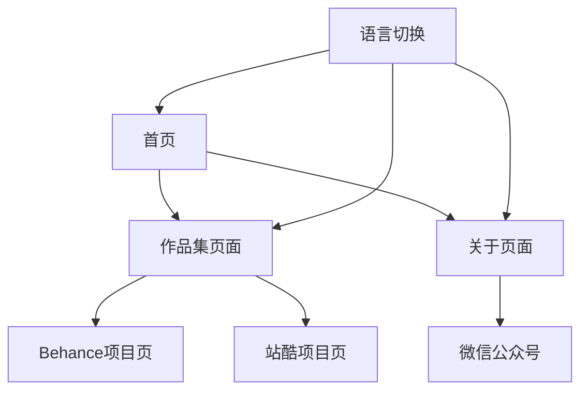

## 1. 产品概述
上游文创（Up-Brands）需要一个免费、快速的双语展示网站，替代现有的Webflow付费方案。网站主要展示设计作品集，所有图像和案例资料直接链接到Behance、站酷和微信公众号，避免本地存储大文件。

目标用户为国内外潜在客户和合作伙伴，通过简洁高效的方式展示设计实力，降低运营成本的同时保持专业形象。

## 2. 核心功能

### 2.1 用户角色
本网站为展示型网站，无需用户注册登录功能。

### 2.2 功能模块
上游文创网站包含以下核心页面：
1. **首页**：品牌介绍、精选作品展示、语言切换
2. **作品集页面**：分类展示所有项目，外部平台链接
3. **关于页面**：公司介绍、联系方式、微信公众号链接

### 2.3 页面详情
| 页面名称 | 模块名称 | 功能描述 |
|-----------|-------------|---------------------|
| 首页 | Hero区域 | 展示品牌标语和核心设计理念，自动轮播精选作品缩略图 |
| 首页 | 导航栏 | 包含Logo、菜单项（作品集、关于）、语言切换按钮 |
| 首页 | 精选作品 | 展示3-6个代表性作品，点击跳转到对应外部平台 |
| 首页 | 页脚 | 包含社交媒体链接、版权信息、联系方式 |
| 作品集页面 | 分类筛选 | 按品牌设计、包装设计、UI设计等分类展示 |
| 作品集页面 | 作品网格 | 卡片式布局展示作品缩略图，悬停显示项目信息 |
| 作品集页面 | 外部链接 | 每个作品卡片链接到Behance或站酷对应项目 |
| 关于页面 | 公司介绍 | 展示公司历史、团队、服务理念 |
| 关于页面 | 联系方式 | 邮箱、电话、地址信息 |
| 关于页面 | 微信公众号 | 展示二维码和公众号名称 |

## 3. 核心流程
用户访问网站时，系统根据IP地址自动判断语言偏好（国外用户显示英文，国内用户显示中文）。用户可以通过导航栏的语言切换按钮手动切换语言。

主要用户流程：
1. 用户进入首页 → 浏览精选作品 → 点击感兴趣的作品 → 跳转到Behance/站酷查看详情
2. 用户进入作品集页面 → 筛选分类 → 浏览作品 → 点击跳转到外部平台
3. 用户进入关于页面 → 了解公司信息 → 关注微信公众号或获取联系方式

## 4. 用户界面设计

### 4.1 设计风格
- **主色调**：深灰色 (#1a1a1a) 和白色 (#ffffff) 为主，红色 (#e74c3c) 作为强调色
- **按钮样式**：简约矩形设计，悬停时有轻微阴影效果
- **字体**：中文使用思源黑体，英文使用Helvetica Neue，标题24-32px，正文16px
- **布局风格**：极简主义，大量留白，卡片式布局展示作品
- **图标风格**：使用线性图标，保持简洁一致的视觉风格

### 4.2 页面设计概述
| 页面名称 | 模块名称 | UI元素 |
|-----------|-------------|-------------|
| 首页 | Hero区域 | 全屏背景图，中心对齐的品牌标语，底部滚动指示器 |
| 首页 | 精选作品 | 三列网格布局，图片懒加载，悬停时显示项目标题和分类 |
| 作品集页面 | 分类筛选 | 顶部标签式筛选器，选中状态使用红色下划线 |
| 作品集页面 | 作品网格 | 响应式网格（桌面4列，平板2列，手机1列），卡片间距20px |
| 关于页面 | 公司介绍 | 时间轴式设计，配合简洁图标说明发展历程 |

### 4.3 响应式设计
采用桌面优先设计策略，确保在大屏幕上展示效果最佳。通过媒体查询适配平板和手机设备：
- 桌面端：1200px以上，展示完整布局
- 平板端：768px-1199px，调整网格列数和字体大小
- 手机端：767px以下，单列布局，优化触摸交互

### 4.4 性能优化
- 所有图片使用外部链接，不占用本地存储
- 实现图片懒加载，提升初始加载速度
- 使用CDN加速静态资源
- 压缩CSS和JavaScript文件
- 预加载关键资源