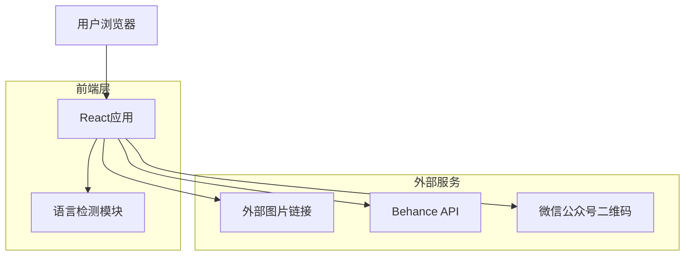

## 1. 架构设计



## 2. 技术描述

- **前端框架**：React@18 + Vite@4
- **初始化工具**：vite-init
- **样式框架**：Tailwind CSS@3
- **语言处理**：i18next + react-i18next
- **部署平台**：Vercel/Netlify（免费套餐）
- **图标库**：Lucide React（轻量级）
- **图片优化**：React LazyLoadImage

## 3. 路由定义

| 路由 | 用途 |
|-------|---------|
| / | 首页，展示品牌介绍和精选作品 |
| /portfolio | 作品集页面，分类展示所有项目 |
| /about | 关于页面，公司介绍和联系方式 |

## 4. 核心组件架构

### 4.1 语言检测与切换
```typescript
// 语言检测逻辑
const detectLanguage = (): string => {
  const userLang = navigator.language || navigator.languages[0];
  const isChina = /zh-CN|zh/.test(userLang);
  
  // 简单的IP检测作为补充
  fetch('https://ipapi.co/json')
    .then(res => res.json())
    .then(data => {
      if (data.country === 'CN') return 'zh';
      return 'en';
    });
  
  return isChina ? 'zh' : 'en';
};
```

### 4.2 外部链接管理
```typescript
interface Project {
  id: string;
  title: string;
  category: string;
  thumbnail: string; // 外部图片URL
  externalUrl: string; // Behance/站酷链接
  platform: 'behance' | 'zcool';
}

const projects: Project[] = [
  {
    id: '1',
    title: '品牌视觉设计',
    category: 'branding',
    thumbnail: 'https://mir-s3-cdn-cf.behance.net/project_modules/max_1200/xxx.jpg',
    externalUrl: 'https://www.behance.net/gallery/xxx',
    platform: 'behance'
  }
];
```

## 5. 性能优化策略

### 5.1 图片加载优化
```typescript
import { LazyLoadImage } from 'react-lazy-load-image-component';

const OptimizedImage = ({ src, alt }: { src: string; alt: string }) => (
  <LazyLoadImage
    src={src}
    alt={alt}
    effect="blur"
    threshold={100}
    wrapperClassName="image-wrapper"
  />
);
```

### 5.2 静态资源优化
- 使用Vite的代码分割功能
- 启用Gzip压缩
- 配置合理的缓存策略
- 使用Tree Shaking移除未使用代码

## 6. 部署配置

### 6.1 Vercel配置（vercel.json）
```json
{
  "builds": [
    {
      "src": "package.json",
      "use": "@vercel/static-build"
    }
  ],
  "routes": [
    {
      "src": "/(.*)",
      "dest": "/index.html"
    }
  ]
}
```

### 6.2 环境变量
```env
VITE_APP_TITLE=Up-Brands 上游文创
VITE_BEHANCE_PROFILE=https://www.behance.net/up-brands
VITE_ZCOOL_PROFILE=https://zcool.com.cn/u/up-brands
VITE_WECHAT_QR=https://mp.weixin.qq.com/xxx/qrcode.jpg
```

## 7. 开发规范

### 7.1 组件结构
```
src/
├── components/          # 可复用组件
│   ├── Layout/         # 布局组件
│   ├── ProjectCard/    # 作品卡片
│   └── LanguageSwitch/ # 语言切换
├── pages/              # 页面组件
│   ├── Home/          # 首页
│   ├── Portfolio/     # 作品集
│   └── About/         # 关于
├── hooks/              # 自定义Hook
├── utils/              # 工具函数
├── locales/            # 语言文件
│   ├── zh.json
│   └── en.json
└── assets/             # 静态资源
```

### 7.2 命名规范
- 组件名：PascalCase（如：ProjectCard）
- 文件名：camelCase（如：languageSwitch.tsx）
- CSS类名：kebab-case（如：project-card）
- 常量：UPPER_SNAKE_CASE

## 8. 监控与分析

### 8.1 性能监控
- 使用Vercel Analytics监控页面性能
- 配置Lighthouse CI进行性能测试
- 监控Core Web Vitals指标

### 8.2 访问统计
- 集成Plausible Analytics（隐私友好）
- 跟踪外部链接点击事件
- 监控语言切换使用情况